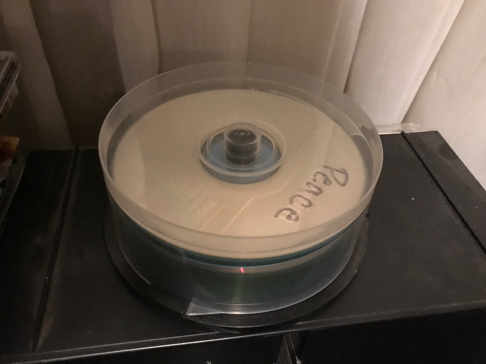
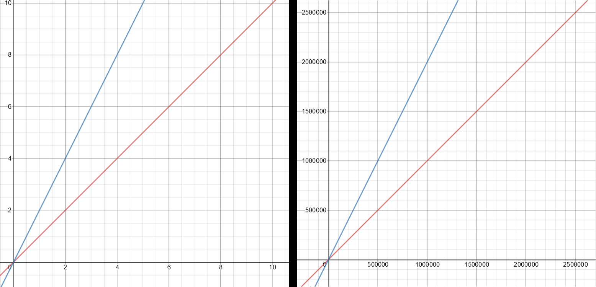
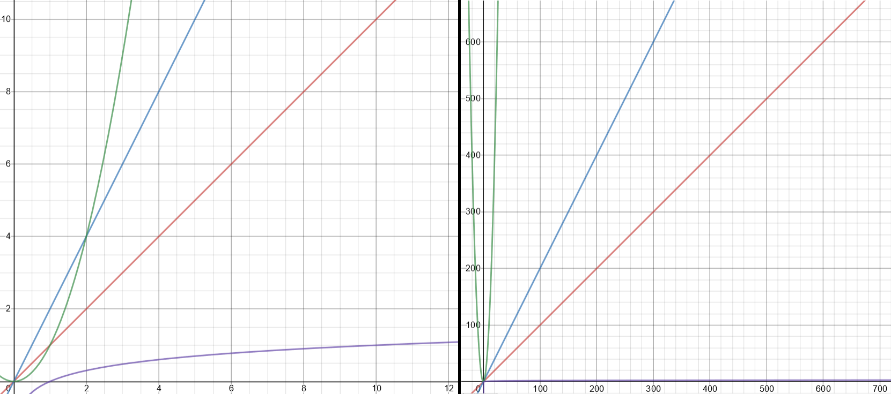

# Stacks
## Index
[Welcome](0-Welcome.md)

[2 Sets](2-Sets.md) (Next Data Structure)

[3 Trees](3-Trees.md) (Next Data Structure)
## Table of Contents
[Overview](#Overview)

[Big-O-Notation](#Big-O-Notation)

[Review Together](#Review_Together)

[Vocab Definitions](#Vocab)

[Solve Together](#Solve_Together)

[Try It!](#Try_It!)

## Overview
A **Stack** is characterized by the order in which the data is processed. As you place items into a stack it works exactly like a stack of something else in real life. The first item in the stack will be on the bottom and the last will be on top. In order to get to the last item, you have to take each item on top of it off first. An example that you might consider to help visualize it, are the spindles that you would place CDs onto. In this you create a stack of many CDs. As you place each CD on the stack, we would call it a **push** function. If you are searching for a specific one, you have to remove each one at a time to see what the CD is. This removing of items from the stack is called a **pop** function. If you're searching for the one that happens to be on the bottom, it will take a long time to get to! This is where it may start to seem a little confusing because what you and I would call the bottom is called the **front** of a stack, and the top would be the **back** of a stack. For this part it might be helpful to envision it more like a train. The engine is the first car on the train tracks and the front of the train. The caboose is the very last car on the tracks and on the back of the train.


## Big-O-Notation
**Big-O Notation** is a measure of how much time it takes the computer to perform a task (such as a function or algorithm), based off of the data we are feeding it. When we look at assigning a value, we always think of the worst-case scenario, when the data are really big. If there were 100 CDs on the stack and you looking for one that happened to be on the very bottom, then you would have to look through all 100 of them. Giving it a constant value we could say that scenario was O(100) (We would speak this as: O of 100). We can generalize this situation to say that the entire data we have to search through is n. Since big O notation deals with hypothetical scenarios, we would generalize this sort of formula to O(n).


This could be turned into a graph, where O = n or into more traditional terms, y = x. This would create a linear function that's directly proportional. Let's consider a different example. If we were searching for two different items in two different stacks of CDs, then we would probably start looking in one, and if we didn't find both of the CDs that we were looking for, move onto the next. To write this as a program, we could choose to write two different loops, with each one searching for the items. Thinking about what we discussed in the previous paragraph, what might the big O notation for this be?

```python
for c in range(n):
    if c == cd1 or c == cd2:
        print("You found it!", c)
for d in range(m):
    if d == cd1 or d == cd2:
        print("You found it!", d)
```

We could think of this algebraically again, and add the two ns together to get O(2n). If we were to graph this, we could see that this graph would give us worse performance than O(n). If you were to zoom out - remember big O notation is for when data are really big - then we can see it's just the same as when the data was small. We would actually then generalize this situation to drop the coefficient and write it as just O(n). 

 

Let's think now about searching for those same disks again, but this time we are looking for many different ones in the same stack, that we wanted to burn onto a new CD. We could write this situation as a loop within a loop. This would then take both of the outputs and add them together. 
```python
for cd in stack:
    for second in stack:
        burned_disc = cd + second
        print(burned_disc)
``` 
If we are looking at big O notation of this example, we would have to multiply each loop together, thus it would be O(n) * O(n) = O(n^2). In looking at the graph, we can see that this polynomial would very quickly take much more time than the other two examples. This is something that we would want to avoid in writing our code, as it can very quickly eat up the resources available to it. 

One last situation to consider in writing big O notation. We can actually get better performance than O(n). If we were able to search through a list of numbers in order from 1-100, we would be able to compare a number in the middle to the number we are searching for. If the number in the middle is less than the number we are searching for, we can then cut the data in half, because we know it has to be greater than the middle number. We can repeat this process of comparing the middle number and cutting in half, until we find the number we are looking for. This would be characterized by O(log n). If we graph this with the others, we have alreay reviewed, we can see that it has the best performance. 
 
When the data gets very large it becomes hard to see O(log n) as it appears to become practically horizontal. A similar thing happens with O(n^2). It's not quite there in this screenshot, but when the data becomes large it starts to look like a verticle line.

When getting into more complex functions you may look at it and think you need to write complex polynomials with n^2 and n, but similar to how we drop all coefficients, we will drop the smaller powers as well and keep whatever is the largest. If after evaluation a function we were to add it all together as O(n^4 + 5n^2 + 3n + 7) it would simplify to just O(n^4). (Think of how much the difference of performance O(n^2) is compared to O(n) and now consider O(n^4). Would we want to write code that takes that much time anyways, or would it be better to consider different solutions?)

## Review_Together
Now that we've learned all about the different ways of measuring time in big-O notation, look back at the two operations that were mentioned at the beginning (Push, and Pop). What do you think their big O notation might be?

There are two different types of data structures that we can create our stack from. For the example code provided in this tutorial we will be building it based off of a dynamic array. Another you could use is a linked list. This is a little more complicated to make and to adjust the structure in the same way as shown, but it would still be a viable alternative, since the performance will be the same.
#
### Syntax
|Sample Code|What it Does|Big O|
|-----|-----------|------|
|`stack.pop()`|Removes the last item from the stack|O(1)|
|`stack.append(data)`|Add 'data' to the end of the stack. ("Push" as discussed earlier)|O(1)|
|`len(stack)`|Returns the size of the stack|O(1)|
|`stack = []`| Initializes the stack| |

What other features can you make from these functions?

### Vocab
* *Stack:* A data structure where items are added to and removed from the end of a list.
* *Push:* Adding an item to a stack.
* *Pop:* Removing an item from a stack.
* *Front:* The first item in the stack.
* *Back:* The last item in the stack.
* *Big-O Notation:* A way of determining how much time it will take the code to perform a task.

### Solve_Together
Let's take a look at some example problems that we can work through together.
In the following code we have a group of escaped chickens that we are chasing after. We are trying to capture all of them, and start with the ones closest to us (the ones that escaped last) and work our way from there.
```python
#Here we initialize with escaped chickens
escaped_chickens = []
for i in range(4):
    escaped_chickens.append(i)
```
In order to start catching some of them we need to write something that will start to take chickens off of the list. Let's write a loop that will catch all of the chickens. Iterating 7 times should be enough times to catch them all. You may write something like the following:
```python
for c in range(7):
    escaped_chickens.pop()
    print("Congrats, you caught a chicken!")
```
If you used the same code that I did, then you would get an error that looks something like the following:


Why might this error occur? What clues can you gather from the error message?

It is important that when you write loops, or anything else, that will use a pop function, to check that you are not trying to remove from an empty stack. This will give the error that we experienced here. We can check if the stack is empty by adding an if statement to check the length of the stack. Oh, No! In the time that we have spent dealing with the error in our code some more chickens escaped. (Add this code before the loop to catch the chickens)
```python
escaped_chickens.append(4)
escaped_chickens.append(5)
```
Now let's make sure we are able to catch just the chickens that escaped and not run into any more errors. We need to add some code that looking something like the following to our loop:
```python
for c in range(7):
    if len(escaped_chickens) > 0:
        chicken = escaped_chickens.pop()
        print("Congrats, you caught chicken number", chicken)
    else:
        print("You caught all of the chickens! Good job!")
```
 Yay, you did it! Way to go catching all of the chickens! You put some real work into that!

Notice that in the output, it counts backwards. The stack will remove the last item added to it first, like how I said we were going to catch the chickens that escaped last, and therefore closest to us, first.

## Try_It!
In the folder there is a document titled stacks_practice.py Open this file and try to make a solution for the problem sets. Once you have completed the problems, open the Stacks_Solution.py This will be an implemented solution. It is possible for yours to look different and still be correct. 

[Back to top](#Stacks)