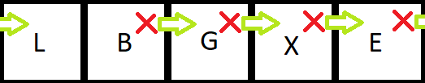

# Sets
## Index
[Welcome](0-Welcome.md)

[1 Stacks](1-Stacks.md) (Previous Data Structure)

[3 Trees](3-Trees.md) (Next Data Structure)

## Table of Contents

[Overview](#overview)

[Ah Oh! Conflict is Arising](#Ah_Oh!_Conflict_is_Arising!)

[Review Together](#review_together)

[Vocab Definitions](#Vocab)

[Solve Together](#Solve_Together)

[Try It!](#Try_It!)

## Overview
The idea of a set comes from a similar idea to what a set is in mathematics. A **set** is a unique data structure that can be built off of a dynamic array. Compared to a set, there are key differences. In the stack everything was added or removed from the back of the data structure. With a set the item can be added anywhere in the structure. This contrast furthers with a stack in that duplicate items can be added to a stack. If you remember in the simple text editor, we created in the example problem from stacks, there were plenty of repeated letters in it. Sets do not accept duplicate values. This can be helpful if we only care about unique values. If you have any experience with a database, this is like creating keys in a database where we want different names. If you picture with me your shirts hanging in the closet, it might be helpful to understand a set. You probably didn't hang your shirts in any particular order. (I certainly don't. Besides what type of shirt it is.) If you were to pack up some shirts and move, they would most likely end up in a different order than you had them hanging before. You also probably wouldn't like having a whole bunch of the same shirt either. You buy different shirts so that you get variety and people don't think you're wearing the same shirt every day.

We also are able to look up items in a set very quickly since there are only unique values. When looking through your closet for a shirt, you can probably see them all there, and don't have to go searching for a specific one that's already hanging up. The process that allows you look up the data quickly is done through hashing. Similar to how the use of a hash tag on social media will point you to other posts about the same content, a **hash** will direct you to where the item is in the data structure. Let's consider a simple example of adding letters to a set that can hold 5 different values. The letters will actually be converted into their value equivalents for the hash to process them in a **hashing function**. For simplicity sake, I will just write out the letters in my diagrams. Let's start by adding B, and E to this array. Since B is the second letter in the alphabet, we will add it to the second index item in the set. E is the 5th letter in the alphabet so we can add it as the 5th item in the index.


This set has a few more spaces in it than the number of items within it. This can happen within sets, in order to keep that simple look-up with the hashing. This is known as a **sparse list**. If we were to create a spot for every letter in the alphabet, but still store only B and E, then it would be a very sparse list. Now imagine what it might be like if we were trying to store with the same principle but we only had three numbers: 5, 739, and 23,000,000. That would be a lot of wasted space between those elements! This is why we often opt for smaller sizes, but with those come conflicts. 

## Ah_Oh!_Conflict_is_Arising!
**Conflicts** occur when there are multiple items that according to our hash function should be stored in the same spot. Let's say that for our letter example we take the numerical value and use modular division to it by 5. Then the value -1 (since index locations start at 0) will be the index location we store it in the set. Now, let's add G. Where would it go? This would create a conflict as the G is supposed to go where the B is. 

When trying solve conflicts we can try a couple of different methods. The simpler one is done by looking for another open space that the data can be put into instead. This is known as **open addressing**. The simplest way is to put it in the next available spot. Similar to how you might just stick a shirt into your closet at the available space between other shirts. This could be done by looking to see if the next space to the right is open. If not move onto the next spot. It could just as easily be written to skip two spaces or more, but for this example we will move just one space. Now let's finally put G into our set using open addressing. Our set will look like this:


We need to add in a couple more letters. Next, we will add in X. X is the 24th letter in the alphabet, so 24 % 5 = 4. Then remove one for the index location, 4-1=3 Perfect! There's no letter in that place, we can just add it in. Almost done, just one last letter to add, this one is L. Using the same hashing function, we get 1 as the index spot we need to enter it in as. Looking at the letters already in our set, B is in the way. Moving along the set we will try to put it in index position 2. G is already in that spot so we have to move along again. Eventually it will see that next (and only) open spot is in the first element. The set will now look like this:



What a mess! If we were searching through to look for L it would have to loop through the whole set. That would give us O(n).

A second way of conflict resolution deals with creating a list that the index location points to. This allows us to continue adding without all of the extra shuffling around of elements. This is called **chaining**. This is similar to how I said earlier that I just organize my shirts by what type of shirt they are. If we took the same data but instead use this method of conflict resolution it would look like this:


## Review_Together
To sum up all of what we have discussed so far, is that sets do not accept repeated values. Sets are hashed for quick access, but this also causes sets to not store values in order. If the size of a set is too small then there are lots of conflicts, and there are a couple of methods, known as open addressing, and chaining to resolve these conflicts. 

### Syntax
|Sample Code|What it Does|Big O|
|-----|-----------|-----|
|`set3.add(data)`|Removes 'data' from the set|O(1)|
|`set8.remove(data)`|Add 'data' to the set|O(1)|
|`len(set4)`|Returns the size of the set|O(1)|
|`union(set1, set2)`|Returns a new set that is the combination of each unique value of set1 and set2|O(n)|
|`set3 | set4`|Shorthand for writing a union as show above|O(n)|
|`intersection(set5, set6)`|Returns the shared values of set5 and set6|O(n)|
|`set7 & set8`|Shorthand for writing an intersection as show above|O(n)|
|`this_set = {1, 2, 3}`| Initializes a set with data|O(1)|
|`your_set = set()`| Initializes an empty set|O(1)|

### Vocab
* *Set:* A data structure that is hashed and does not accept duplicate values.
* *Hash:* Creating pointers as to where the data is stored. O(1)
* *Hashing Function:* A function that changes non-integers into an integer value, so that it can be processed by a hash.
* *Sparse List:* A set that does not fully use all of the memory allocated for it.
* *Open Addressing:* A way of conflict resolution in which the data is put into the next available spot.
* *Chaining:* A way of conflict resolution in which the data is put into a secondary set that builds off of the spot it would go in the set.

### Solve_Together
Let's take an example of trying to find the intersect of two graphs. We will only graph the values from (-5,-5) to (5,5) and count by whole numbers. Let's graph y = x and y = 2x + 2. These are simple enough to figure out on our own, but let's see what it would look like to get a computer to solve it. Take a moment to consider how we could take advantage of sets for the solution to this problem.

Begin by adding in the points on the graph to two different lists. You code may look something like the following:
```python
graph1 = []
graph2 = []
for c in range(-5, 6):
    graph1.append("({},{})".format(i, i))
for c in range(-4, 1):
    graph2.append("({},{})".format(2*i+2, i))
```
Now that we have the two different lists, we need to add them to a stack. We can write this code like the following
```python
intersect = set()
for i in graph1:
    intersect.add(i)
for i in graph2:
    intersect.add(i)
```
There now that we've added everything, let's see what was actually stored in the set.
```python
for e in intersect:
    print(i)
```
If you ran the program you may have noticed they are all in a random order. Try running it again, and see what happens. 


After running it a second time, you'll probably get a completely different order. This is because sets do not keep order like stacks do.


Now it's nice we've added all of that to a set, but where's the intercept? How can we find that out? This is where we can take advantage of a set not accepting a duplicate value. Normally python will just silently throw away any duplicate value when we try to add it to the set. We will add an if statement to display the duplicate value. You can comment out the last for loop to print the items in our set. Then go back to the loop when we were adding values from the second graph to the set. We will edit the code to look like this:
```python
for i in graph2:
    if i in intersect:
        print("The intersect of the two graphs are:", i)
    else:
        intersect.add(i)
```
Your output should show that the intersection is at (-2, -2) as you can see in the sample graph. Now not only will it detect the intersect for this graph, but the same base program can be applied to other graphs, where there might be more than one intercept. If you want more practice try changing the code to add a third graph, and find the intercept of that one too. 

If you've kept a keen eye, you will have seen that with the code listed in the Syntax chart above, we could accomplish the same task by using the built-in intersection function.

## Try_it!
In the folder there is a document titled sets_practice.py Open this file and try to make a solution for the problem sets. Once you have completed the problems, open the Sets_Solution.py This will be an implemented solution. It is possible for yours to look different and still be correct. 

[Back to top](#Sets)