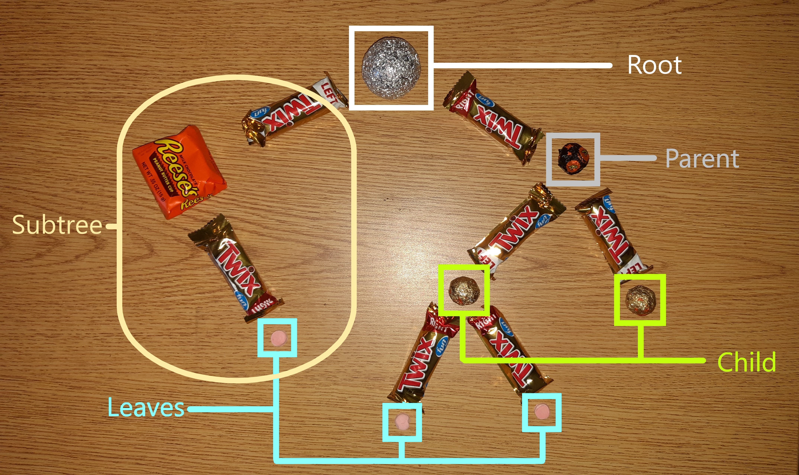

# Trees
## Index
[Wecome](0-Welcome.md)

[1 Stacks](1-Stacks.md) (Previous Data Structure)

[2 Sets](2-Sets.md) (Previous Data Structure)

## Table of Contents

[Overview](#Overview)

[The Binary Tree](#The_Binary_Search_Tree)

[Balance or Fall](#Balance_or_Fall)

[Recursion](#Recursion)

[Review Together](#Review_Together)

[Vocab Definitions](#Vocab)

[Solve Together](#Solve_Together)

[Try It!](#Try_It!)

## Overview
A **tree** is composed of a series of nodes that are all linked together. Much like how a tree in real life starts out at the roots with a trunk that then grows up and splits into different branches, a tree starts off with one value that then can connect to multiple other values. Similarly, to how the trunk starts at the root the very first item in the data structure of a tree is called the **root**. In both trees they eventually branch off until at the very end is a **leaf**. In trees in real life, they can form different kinds of divisions, and while we could still do that in a data structure, it is particularly useful if there are only two branches per split. This is known as a **binary tree**. In this scenario for each **parent** node - a node that links to another - will have no more than two **child** nodes - nodes that connect back to a parent node. These child nodes could also be parent nodes in a different **subtree**. Subtrees are smaller sections of the overarching tree. This is much like how a full Hershey's chocolate bar can be broken into smaller bars as you are eating it. 



## The_Binary_Search_Tree

Now to answer why a binary tree is so useful. It can be made into a **Binary Search Tree** in which the data is sorted. To build this tree the data is compared to the parent element. If it is greater than what is stored in the parent, it will be placed to the right child node. If the data to be placed into the tree is less than what is stored in the parent node, then it will be sorted into the left child node. No duplicate values will be accepted in a Binary Search Tree (BST).

This creates some strong benefits for using this data structure. What might some of them be? This allows us to search the data quite quickly, hence search in the name. Take this tree as follows:

If we were to search for the number of 23 in the tree, we would first look at the number 15. 23 is greater than 15 so we can move to the node to the right. The right node is 50. 23 is less than 50 so we can move to the node to the left. There it is! That took 3 steps instead of having to search through all 9 points of data. That significantly cut out the amount of time it took. This equates to being able to have an O(log n) performance in general when using the data structure. This even applies when what we are looking for isn't stored in the tree. 

## Balance_or_Fall
For all it's good, this method of sorting data could also potentially create a problem. Say you want to store 1-10 into a BST. Let's start at 1 and use the method as described above. 1 would be stored as the root. Then 2 would be stored to the right of 1. We would place 3 into the node right of 2. 4 would be placed right of 3 and so on and so forth. In the end it would just be a long list and not resemble a tree at all. We would gain no benefit from creating a tree for your data to be stored in and it would decrease to O(n) performance. How would you fix this issue?


This is where balancing a tree comes in. For a tree to be balanced there has to be a difference less than 2 between the longest branch and the shortest branch. To do this we simply count the number of nodes from the root to each leaf. Look back at each example of a tree. Which ones are balanced? Usually, the data given will not already be in an ideal order for the tree to be balanced by adding them in order. To solve this problem there are a few different algorithms out there to help support the creation of balanced trees and keep them balanced. Two common ones are red black trees and AVL trees. In general to balance a tree you start with the item in the center of the list and insert it as the root. You then would form a similar process with the items larger than the root and the items smaller than the root. If you update the data then you typically will need to adjust the tree and that's where the algorithms mentioned come in handy. 
(The first two examples are balanced, and only the third one is unbalanced.)

## Recursion
Before we can get into some of the code for a tree, we need to first understand recursion. **Recursion** is a function that calls itself. In a way it is like creating a loop, but through the means of [recursion](#Recursion) (See what I did there. It was a recursive call to the section you already are at.) we are able to break a big problem into smaller problems that are solvable. To create a recursive function, you always have to have at least two things otherwise it could go on forever. Those two things are what's called a base case, and the smaller problem. The **base case** is when the recursive function will stop at and no longer needed. Typically, this is set up with using an if... else... statement. You can look in the sets example problem to see the recursive function I used in there. Here is also an example of recursion:
```python
def recursion(numbers):
    if numbers <= 0:
        print("This is a base case")
    else:
        print("This is the", 10-numbers , "recursive call")
        recursion(numbers-1)
recursion(10)
```

Since [recursion](#Recursion) continues calling itself, depending on what we are calling the function to do, its number of recursive calls can grow exponentially and lead to poor performance. Something to help limit poor performance can be the use of memoization. Similar to memorization, **memoization** (Yes, that's really how it's spelled) is a process that allows the computer to "remember" where it has already done. To do so we need to use a dictionary (which is not explicitly covered in this tutorial, but think of it as a set within a set. This is similar to chaining. Defined by `example = dict()` ) to store the values that we have already calculated. We then use these results as an additional base case in the recursive calls. We need to also initialize this dictionary the very first time we go through the loop so it can store all of the values and be used in all the recursive calls. To code this it might look something a little like this:
```python
def memoization(num, dictionary = None):
    if dictionary is None:
        dictionary = dict()
    if num <= 1:
        return 1
    # If you were to remove this if statement, it would take a long time to calculate
    if num in dictionary:
        return dictionary[num] 
    
    calc = (memoization(num-1, dictionary))^num + (memoization(num-1, dictionary))^(num-1)
    dictionary[num] = calc
    return calc

print(memoization(100))
```

## Review_Together
Binary Search Trees are a very helpful and well performing data structure that typically is implemented in 0(log n) time. It requires a little more work to maintain that performance with balancing algorithms. Typically recursion is involved in the BST functions.

### Syntax
Here are some common examples of BST functions that you are likely to find in any BST class.
|Sample Code|What it Does|Big O|
|-----|-----------|--------|
|`my_tree.insert(data)`|Adds 'data' to the BST.|O(log n)|
|`my_tree.traverse()`|Will loop through the BST with each item in order from smallest to greatest.|O(log n) -|
|`my_tree.size()`|Will return the overall size of the tree.|O(1)|
|`my_tree.height(node)`|Will return the height of the node from the root.|O(log n)|
|`my_tree.contains(data)`|Determines if 'data' is in the tree.|O(log n)|

### Vocab
* *Tree:* A type of data structure where an item is linked downwards to potentially multiple other items.
* *Root:* The first element or node in a tree.
* *Leaf:* The last element or node in a tree.
* *Binary Tree:* A type of tree that for each parent node has no more than two child nodes.
* *Parent:* A node that has other nodes to the left and/or to the right.
* *Child:* A node that is attached to another node above it.
* *Subtree:* A broken down smaller tree that is composed of at least one parent and child node.
* *Binary Search Tree:* A type of binary tree that is organized to achieve O(log n) notation.
* *Recursion:* A function that calls itself in the body of the function
* *Memoization:* A way for recursion to be able to remember what calculations it has already performed, thus speeding up the process.

### Solve_Together
For the practice code that we will be reviewing in this section requires a BST class to have already been built. We will just be practicing how to build a function within that class.

Alternatively, from traversing forwards we can also traverse backwards. We will look at how to accomplish this in our practice problem. 

To start off we need to define a reversed iter function. This will initiate the traverse backwards function. We will use `yield` in this reversed function to give each result and the go back to the function.
```python
def __reversed__(self):
    yield from self._traversing_backwards(self.root)
```

Now that we have the reversed function let's think about how to accomplish the traversing backwards function. If we want to get the results from the tree in descending order, we need to start at the largest item. With a BST the larger items are on the right. In that case we would start on the right side of the tree and then need to move to the left. We can start to write a function like the following:
```python
def _traversing_backwards(self, node):
    yield from node.right
    yield from node.left
```

At this point it will return just the item immediately to the right of the root and then to the left of the root. There are two additional steps we need to implement. First, we need to involve [recursion](#Recursion) in this problem. If we are calling the same function it will require us to consider what the base case will need to be. If we get to the end of the tree then the nodes will be none. That would make a good base case in this problem. An even better solution would be to combine the base case with the smaller problem for an even simpler function. To do this we could use an if statement to check that the node is not none. Then whenever there is a value in the node, we can perform the recursive calls. As soon as there isn't it'll simply return to the function.
```python
def _traversing_backwards(self, node):
    if node is not None:
        yield from node.right
        yield from node.left
```

If this was what you had done for the function and simply left it at that, there would be a big error! While we are managing to iterate through the whole tree, we wouldn't be returning any of the data, which is the whole point of it. to do this we will need to add a yield for the node data so that we can see what's inside. The completed code should look like this:
```python
def _traversing_backwards(self, node):
    if node is not None:
        yield from node.right
        yield node.data
        yield from node.left
```

## Try_it!
In the folder there is a document titled trees_practice.py Open this file and try to make a solution for the problem sets. Once you have completed the problems, open the Trees_Solution.py This will be an implemented solution. It is possible for yours to look different and still be correct. 

[Back to top](#Trees)